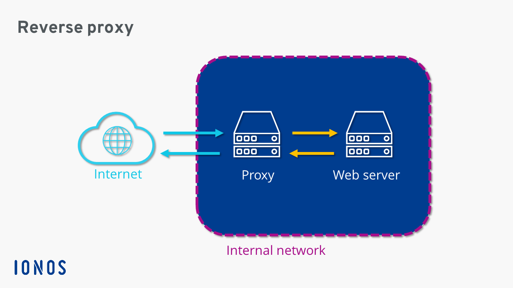

# Nginx and microservices
Este repositorio tiene un docker compose que levanta un docker para un nginx y cuatro dockers con sus apis rest.


## Docker compose
### Up 🚀
Run command where is the docker-compose.yml file. In /NinxWeb

```
docker-compose up -d
```
### Build 🕒
```
docker-compose up --build
```

### Status view 🩺
```
docker container ps
```

## Microservices 
### Paths: http://localhost:6001
- ApiOne: /api/v1/pets - GET
- ApiTwo: api/v2/countries - GET
- ApiThree: api/v3/ipa - GET
- ApiFour: api/v4/random - GET

### Run the microservices separately by example:
#### Api One
```
cd /ApiOne.Dc
dotnet run
```

#### Api Two
```
cd /ApiTwo.Dc
dotnet run
```

#### Api Three
```
cd /ApiThree.Dc
dotnet run
```

#### Api Four
```
cd /ApiFour.Dc
dotnet run
```
